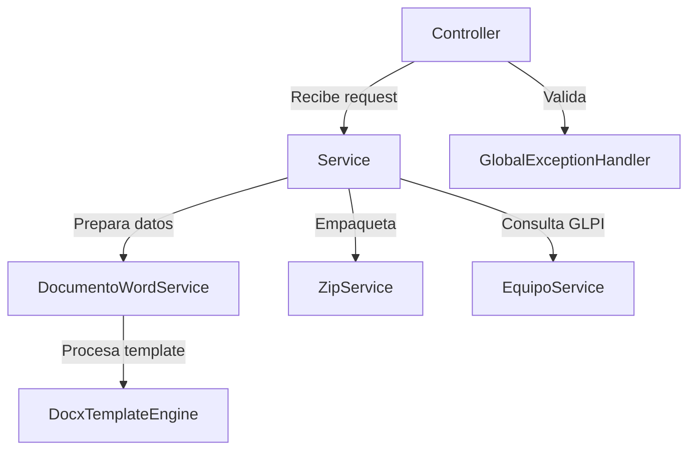
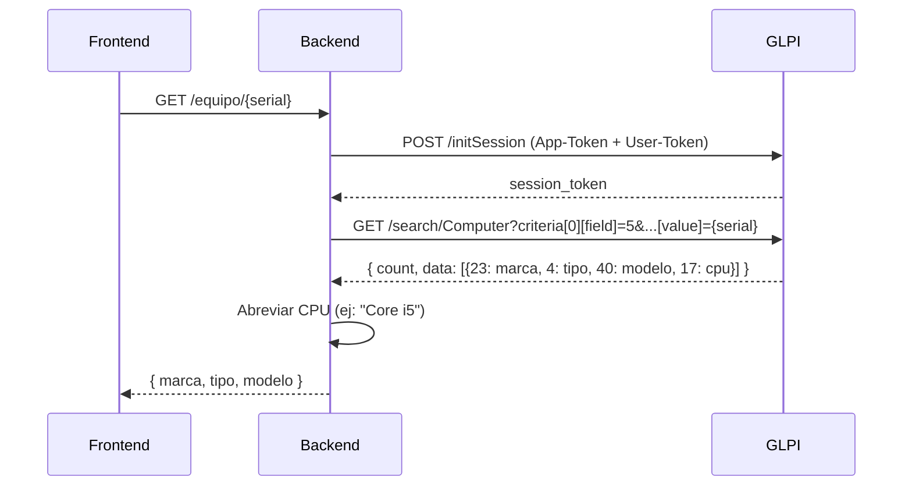
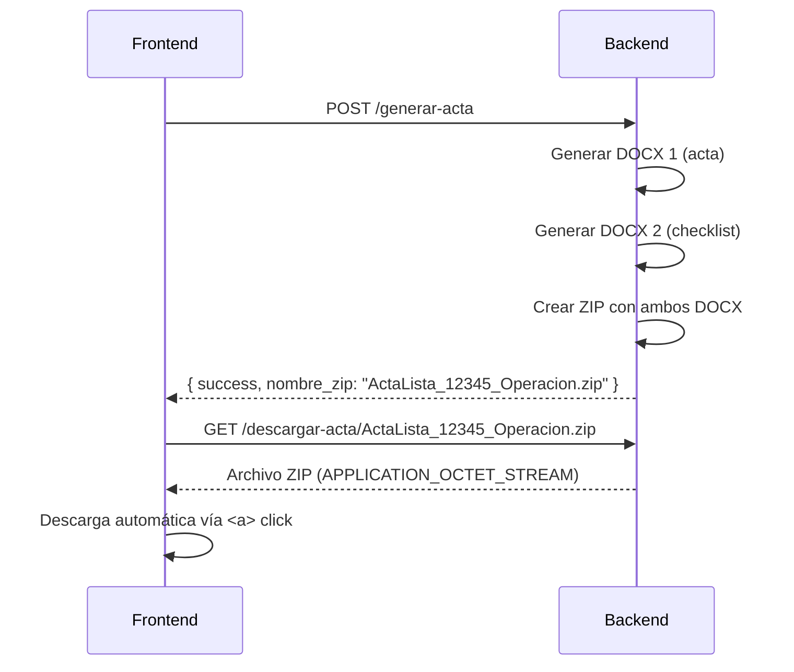

# Arquitectura del Sistema

## Visión general

El sistema actas-glpi sigue una arquitectura **cliente-servidor** de dos capas:

```
┌─────────────────┐         HTTP/JSON        ┌─────────────────────┐
│                  │ ───────────────────────► │                     │
│    Frontend      │                          │    Backend API      │
│  (HTML/JS/CSS)   │ ◄─────────────────────── │  (Spring Boot)      │
│                  │     ZIP descargable       │                     │
└─────────────────┘                          └──────────┬──────────┘
                                                        │
                                                        │ HTTP REST
                                                        ▼
                                             ┌─────────────────────┐
                                             │   Instancia GLPI    │
                                             │  (API REST externa) │
                                             └─────────────────────┘
```

## Backend

### Stack tecnológico

- **Java 21** con Spring Boot 3.4.1
- **Maven** para gestión de dependencias
- **Apache POI 5.2.5** para manipulación de documentos Word
- **Jackson** para serialización JSON
- **Jakarta Validation** para validación de DTOs
- **Lombok** para reducir boilerplate

### Paquetes del backend

```
com.empresa.actas/
├── ActasApplication.java          # Punto de entrada
├── config/
│   ├── AppConfig.java             # Carga .env, crea directorio de salida
│   └── CorsConfig.java           # Permite peticiones desde el frontend
├── controller/
│   ├── ActaController.java        # POST /generar-acta, GET /descargar-acta/{zip}
│   ├── DevolucionController.java  # POST /generar-devolucion
│   └── EquipoController.java      # GET /equipo/{serial}
├── dto/
│   ├── request/
│   │   ├── ActaRequest.java       # DTO entrada: acta de entrega
│   │   ├── DevolucionRequest.java # DTO entrada: acta de devolución
│   │   ├── EquipoItem.java        # Equipo (serial, marca, tipo, modelo, inv, estado)
│   │   ├── HardwareItem.java      # Hardware entrega (tipo, desc, programa)
│   │   └── OtroElementoItem.java  # Hardware devolución (solo tipo)
│   └── response/
│       ├── ActaResponse.java      # Respuesta: success + nombre_zip
│       ├── ErrorResponse.java     # Respuesta: success + mensaje
│       └── EquipoResponse.java    # Respuesta GLPI: marca, tipo, modelo
├── exception/
│   └── GlobalExceptionHandler.java # Captura errores y los convierte en JSON
└── service/
    ├── ActaService.java           # Orquestador: acta + checklist → ZIP
    ├── DevolucionService.java     # Orquestador: devolución → ZIP
    ├── DocumentoWordService.java  # Prepara datos y genera los DOCX
    ├── DocxTemplateEngine.java    # Reemplaza {{ vars }} en templates Word
    ├── EquipoService.java         # Consulta GLPI por serial
    └── ZipService.java            # Empaqueta DOCX en ZIP
```

### Capas y responsabilidades



**Controller** — Recibe peticiones HTTP, valida con `@Valid`, delega a Service.

**Service** — Orquesta la generación: convierte DTOs a mapas, coordina Word y ZIP.

**DocumentoWordService** — Prepara los datos (fecha indexada, hardware/equipos indexados) y llama al motor de templates.

**DocxTemplateEngine** — Motor de reemplazo de placeholders a nivel de run en documentos Word.

**EquipoService** — Integra con la API REST de GLPI para buscar equipos por serial.

**ZipService** — Empaqueta archivos DOCX en un solo ZIP para descarga.

### Puerto del servidor

| Configuración | Puerto |
|---------------|--------|
| Backend Spring Boot | `8001` |
| Frontend (Live Server) | `5500` |
| Frontend (navegador directo) | `N/A` |

> **IMPORTANTE:** El frontend está hardcodeado a `http://127.0.0.1:8001`. El backend siempre debe ejecutarse en el puerto 8001.

## Frontend

### Estructura

```
frontend/
├── css/
│   ├── styles.css          # Estilos custom (navbar, cards, checklist, etc.)
│   ├── output.css          # CSS generado por Tailwind
│   └── app.css             # Estilos adicionales
├── js/
│   ├── ui.js               # Utilidades compartidas (mostrarMensaje)
│   ├── app.js              # Lógica acta de entrega
│   └── devolucion.js       # Lógica acta de devolución
├── pages/
│   ├── acta-entrega.html   # Página de acta de entrega
│   └── acta-devolucion.html # Página de acta de devolución
└── package.json            # Dependencias (Tailwind, FlyonUI)
```

### Arquitectura de JavaScript

Cada página tiene su propio archivo JS que carga después de `ui.js`:

```
ui.js              (compartido, carga primero)
    ↓
app.js             (entrega)
   — o —
devolucion.js      (devolución)
```

**Separación de responsabilidades:**

- `ui.js` — Funciones de presentación (notificaciones).
- `app.js` / `devolucion.js` — Lógica específica de cada tipo de acta.

### Componentes UI

| Componente | Descripción |
|------------|-------------|
| Navbar | Navegación entre acta de entrega y devolución |
| Formulario de datos | Campos obligatorios del acta |
| Bloques dinámicos | Equipos y hardware, agregados/eliminados dinámicamente |
| Checklist | 36 checkboxes organizados en 6 secciones con acordeones |
| Selector de SO | Radio buttons para Windows 10, Windows 11, Mac OS |
| Botón generar | Envía POST y descarga ZIP |

## Integración con GLPI

### Flujo de consulta



### Campos GLPI consultados

| Campo GLPI | Descripción | Uso en acta |
|------------|-------------|-------------|
| `5` | Serial (filtro de búsqueda) | Búsqueda del equipo |
| `23` | Fabricante | Marca del equipo |
| `4` | Tipo de equipo | Tipo (Desktop, Laptop, etc.) |
| `40` | Modelo | Modelo del equipo |
| `17` | Procesador | Sufijo del modelo (ej: "Core i5") |

### Autenticación

GLPI utiliza dos tokens:
- **App-Token** — Token de aplicación (identifica la app).
- **User-Token** — Token de usuario (identifica al usuario).

Ambos se cargan desde el archivo `.env` y se inyectan como `@Value` en `EquipoService`.

## Generación de documentos Word

### Motor de templates (DocxTemplateEngine)

El motor reemplaza placeholders en formato `{{ nombre_variable }}` dentro de archivos DOCX.

**Algoritmo:**

1. Copiar el template al archivo de salida.
2. Abrir el DOCX con Apache POI.
3. Para cada párrafo (cuerpo + tablas):
   a. Concatenar el texto de todos los "runs".
   b. Si contiene `{{`, procesar.
   c. Buscar todos los placeholders con regex.
   d. Para cada run, reconstruir el texto preservando formato.
4. Guardar el documento.

**¿Por qué a nivel de run?** Word fragmenta el texto en "runs" cuando hay cambios de formato (negrita, color, tamaño). Un placeholder puede estar dividido en 3-4 runs. Este enfoque preserva el formato original sin fusionar runs.

### Templates utilizados

| Template | Generado por | Contenido |
|----------|-------------|-----------|
| `Acta de Entrega 2 2 - copia.docx` | `generarActa()` | Acta de entrega con equipos y hardware |
| `ListaChequeo.docx` | `generarChecklist()` | 36 ítems de verificación + SO |
| `ActaDevolucion.docx` | `generarDevolucion()` | Acta de devolución con estado de equipos |

### Variables de templates

**Variables indexadas:**

| Prefijo | Cantidad | Campos | Ejemplo |
|---------|----------|--------|---------|
| `eq_N_` | 10 | marca, tipo, modelo, serial, inventario | `eq_1_marca = "Dell"` |
| `hw_N_` | 11 | tipo, descripcion, programa | `hw_1_tipo = "Monitor"` |
| `ot_N_` | 10 | tipo | `ot_1_tipo = "Teclado"` |
| `chk_N_si/no` | 36 | (cuadrado marcado/desmarcado) | `chk_1_si = "■"` |
| `win10/win11/macos` | 1 | (cuadrado) | `win10 = "■"` |

**Variables de fecha:**

| Variable | Formato | Ejemplo |
|----------|---------|---------|
| `dia` | `dd` | `23` |
| `mes` | `MM` | `07` |
| `anio` | `yyyy` | `2026` |

## Proceso de descarga ZIP



El frontend crea dinámicamente un elemento `<a>` con `download` attribute para forzar la descarga, luego lo elimina del DOM.

## Validaciones

### Backend (Jakarta Validation)

Validación automática al recibir el request en el controller:

| DTO | Campo | Regla |
|-----|-------|-------|
| `ActaRequest` | fecha | `@NotBlank` |
| `ActaRequest` | entregado_a | `@NotBlank` |
| `ActaRequest` | cargo_recibe | `@NotBlank` |
| `ActaRequest` | entregado_por | `@NotBlank` |
| `ActaRequest` | cargo_entrega | `@NotBlank` |
| `ActaRequest` | asunto | `@NotBlank` |
| `ActaRequest` | numero_sac | `@NotBlank` |
| `ActaRequest` | sistema_operativo | `@NotBlank` |
| `DevolucionRequest` | fecha | `@NotBlank` |

Los errores de validación se capturan en `GlobalExceptionHandler` y retornan HTTP 400 con `ErrorResponse`.

### Frontend (JavaScript)

| Validación | Ámbito | Comportamiento |
|------------|--------|----------------|
| Campos obligatorios | Ambos formularios | Clase `is-invalid` + scroll automático + foco |
| Sistema operativo | Solo entrega | Radio buttons con clase `radio-so-error` |
| Serial del equipo | Ambos formularios | Requerido para cada equipo |
| Inventario del equipo | Ambos formularios | Requerido para cada equipo |
| Estado del equipo | Solo devolución | Requerido para cada equipo |
| Mínimo 1 equipo | Ambos formularios | No se puede eliminar el último |
| Máximo 11 hardware | Ambos formularios | Límite de registros |
| Máximo 10 equipos | Backend (silencioso) | Se ignoran equipos adicionales |
| Máximo 10 equipos GLPI | Backend (silencioso) | Solo se procesan los primeros 10 |

## Configuración

### application.yml

```yaml
server:
  port: 8001

glpi:
  url: ${GLPI_URL:http://10.86.1.33/glpi/apirest.php}
  app-token: ${GLPI_APP_TOKEN:...}
  user-token: ${GLPI_USER_TOKEN:...}

app:
  generated-dir: ${java.io.tmpdir}/actas_glpi_generados
  templates-dir: classpath:plantillas
```

### CORS

Permite orígenes: `127.0.0.1`, `localhost` en puertos 80, 5500 y 8080. Expone el header `Content-Disposition` para descarga de archivos.
