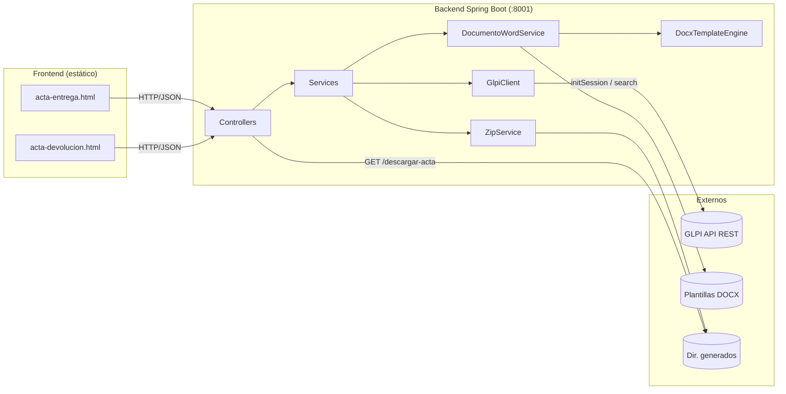
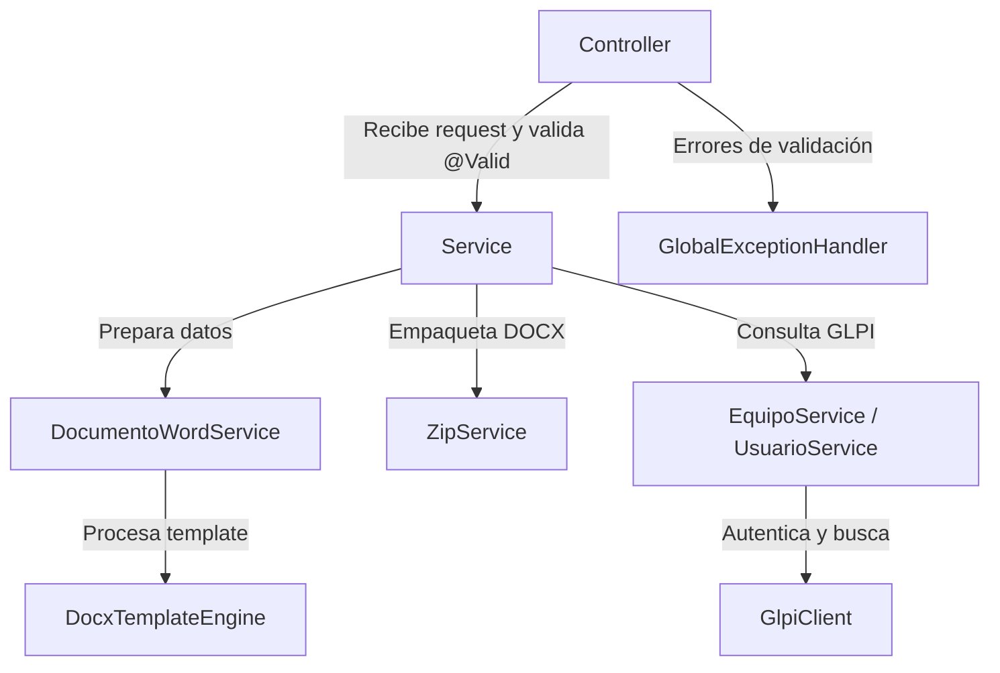
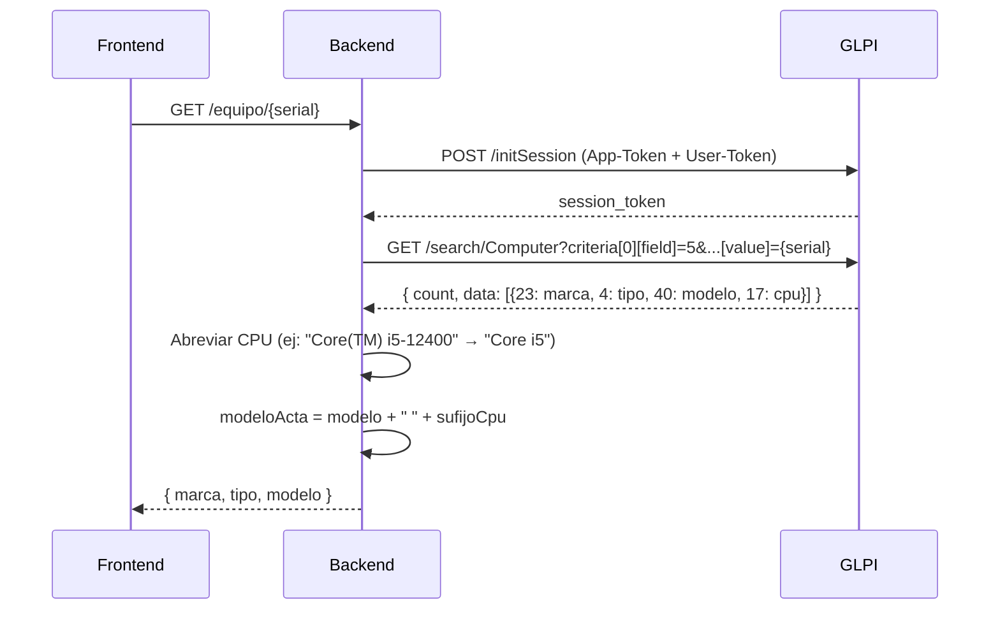
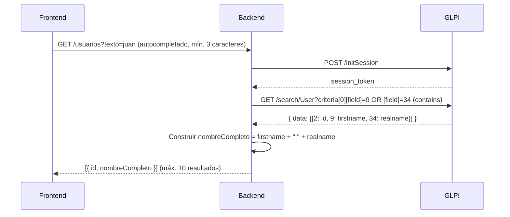
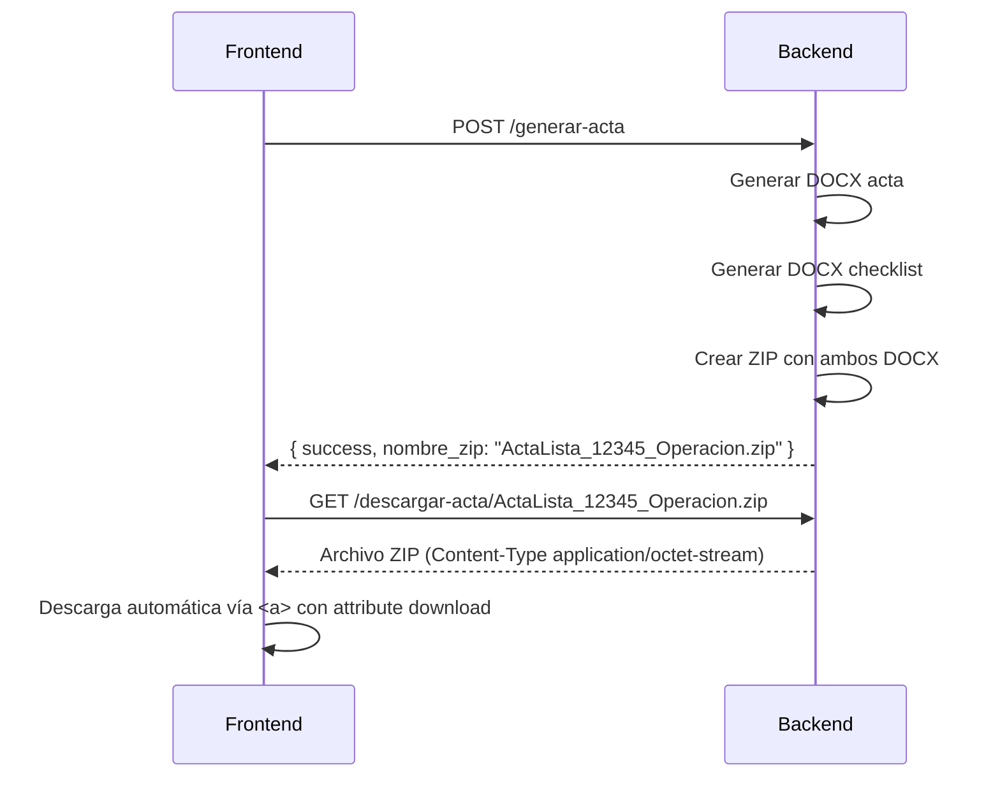

# Arquitectura del Sistema

## Visión general

El sistema actas-glpi sigue una arquitectura **cliente-servidor** de dos capas. El frontend (web estática) se comunica con el backend (API REST Spring Boot), que a su vez consulta la API REST de GLPI para buscar equipos y usuarios, y genera los documentos DOCX.


```mermaid
flowchart LR
    subgraph FE["Frontend (estático)"]
        P1[acta-entrega.html]
        P2[acta-devolucion.html]
    end
    subgraph BE["Backend Spring Boot (:8001)"]
        C[Controllers]
        S[Services]
        W[DocumentoWordService]
        E[DocxTemplateEngine]
        Z[ZipService]
        G[GlpiClient]
    end
    subgraph EXT["Externos"]
        GLPI[(GLPI API REST)]
        DOCX[(Plantillas DOCX)]
        TMP[(Dir. generados)]
    end

    P1 -->|HTTP/JSON| C
    P2 -->|HTTP/JSON| C
    C --> S
    S --> W --> DOCX
    W --> E
    S --> Z --> TMP
    S --> G -->|initSession / search| GLPI
    C -->|GET /descargar-acta| TMP
```

## Backend

### Stack tecnológico

- **Java 21** con Spring Boot 3.4.1
- **Maven** para gestión de dependencias
- **Apache POI 5.2.5** para manipulación de documentos Word
- **Jackson** para serialización JSON
- **Jakarta Validation** para validación de DTOs
- **Lombok** para reducir boilerplate
- **dotenv-java 3.2.0** para cargar `.env`

### Paquetes del backend

```
com.empresa.actas/
├── ActasApplication.java          # Punto de entrada
├── config/
│   ├── AppConfig.java             # Carga .env, crea directorio de salida
│   └── CorsConfig.java            # Permite peticiones desde el frontend
├── controller/
│   ├── ActaController.java        # POST /generar-acta, GET /descargar-acta/{zip}
│   ├── DevolucionController.java  # POST /generar-devolucion
│   ├── EquipoController.java      # GET /equipo/{serial}
│   └── UsuarioController.java     # GET /usuarios?texto=
├── dto/
│   ├── request/
│   │   ├── ActaRequest.java       # Entrada: acta de entrega + checklist
│   │   ├── DevolucionRequest.java # Entrada: acta de devolución
│   │   ├── EquipoItem.java        # Equipo (marca, tipo, modelo, serial, inventario, estado)
│   │   ├── HardwareItem.java      # Hardware entrega (tipo, descripcion, programa)
│   │   └── OtroElementoItem.java  # Otros elementos devolución (solo tipo)
│   └── response/
│       ├── ActaResponse.java      # Respuesta: success + nombre_zip + mensaje
│       ├── ErrorResponse.java     # Respuesta: success + mensaje
│       ├── EquipoResponse.java    # Equipo GLPI: marca, tipo, modelo
│       └── UsuarioResponse.java   # Usuario GLPI: id, nombreCompleto
├── exception/
│   └── GlobalExceptionHandler.java # Convierte errores de validación en JSON (400)
└── service/
    ├── ActaService.java           # Orquesta: acta + checklist → ZIP
    ├── DevolucionService.java     # Orquesta: devolución → ZIP
    ├── DocumentoWordService.java  # Prepara datos y genera los DOCX
    ├── DocxTemplateEngine.java    # Reemplaza {{ vars }} en templates Word
    ├── EquipoService.java         # Consulta equipos en GLPI por serial
    ├── UsuarioService.java        # Consulta usuarios en GLPI por nombre
    ├── GlpiClient.java            # Cliente HTTP compartido para GLPI
    └── ZipService.java            # Empaqueta DOCX en ZIP
```

### Capas y responsabilidades


```mermaid
graph TD
    A[Controller] -->|Recibe request y valida @Valid| B[Service]
    B -->|Prepara datos| C[DocumentoWordService]
    C -->|Procesa template| D[DocxTemplateEngine]
    B -->|Empaqueta DOCX| E[ZipService]
    B -->|Consulta GLPI| F[EquipoService / UsuarioService]
    F -->|Autentica y busca| G[GlpiClient]
    A -->|Errores de validación| H[GlobalExceptionHandler]
```

**Controller** — Recibe peticiones HTTP, valida con `@Valid`, delega en el Service.

**Service** — Orquesta la generación: convierte DTOs a mapas, coordina Word y ZIP.

**DocumentoWordService** — Prepara los datos (fecha indexada, hardware/equipos indexados, checkboxes) y llama al motor de templates.

**DocxTemplateEngine** — Motor de reemplazo de placeholders a nivel de run en documentos Word.

**EquipoService / UsuarioService** — Integran con GLPI vía `GlpiClient`.

**GlpiClient** — Centraliza la autenticación (App-Token + User-Token → session) y el `HttpClient`.

**ZipService** — Empaqueta los DOCX en un ZIP para descarga.

### Configuración y puertos

| Configuración | Valor |
|---------------|-------|
| Backend Spring Boot | `8001` |
| Frontend (Live Server VS Code) | `5501` |
| Orígenes CORS permitidos | `127.0.0.1`/`localhost` en puertos `80`, `5500`, `5501`, `8080` |

> **IMPORTANTE:** El frontend define la URL del backend en `frontend/js/config.js` (`API_URL = "http://127.0.0.1:8001"`). El backend siempre debe ejecutarse en el puerto 8001.

### Variables de entorno

Cargadas desde `.env` (raíz del proyecto) por `AppConfig`, o desde variables del sistema (estas tienen prioridad):

| Variable | Obligatoria | Descripción |
|----------|-------------|-------------|
| `GLPI_URL` | No (hay fallback) | URL base de la API REST de GLPI |
| `GLPI_APP_TOKEN` | **Sí** | App-Token de la aplicación GLPI |
| `GLPI_USER_TOKEN` | **Sí** | User-Token del usuario de la API |

Propiedades de `application.yml`:

```yaml
server:
  port: 8001

glpi:
  url: ${GLPI_URL:http://10.86.1.33/glpi/apirest.php}
  app-token: ${GLPI_APP_TOKEN}      # sin fallback → obligatorio
  user-token: ${GLPI_USER_TOKEN}    # sin fallback → obligatorio

app:
  generated-dir: ${java.io.tmpdir}/actas_glpi_generados
  templates-dir: classpath:plantillas
```

- `app.generated-dir`: directorio donde se guardan los DOCX/ZIP generados (sobrescribible con la propiedad de Spring del mismo nombre).
- `app.templates-dir`: `classpath:plantillas` usa las plantillas dentro de `resources/plantillas`.

## Frontend

### Estructura

```
frontend/
├── css/
│   ├── styles.css          # Estilos custom (navbar, cards, autocomplete, toasts, etc.)
│   ├── output.css          # CSS compilado (Tailwind + FlyonUI), versionado
│   └── app.css             # Fuente Tailwind/FlyonUI (se compila con npm run build:css)
├── js/
│   ├── config.js           # API_URL (carga primero en los HTML)
│   ├── ui.js               # Utilidades compartidas (toasts)
│   ├── autocomplete.js     # Autocompletado de usuarios GLPI
│   ├── app.js              # Lógica acta de entrega
│   └── devolucion.js       # Lógica acta de devolución
├── pages/
│   ├── acta-entrega.html
│   └── acta-devolucion.html
├── img/logo.png
└── package.json            # Tailwind CSS + FlyonUI (build:css)
```

### Arquitectura de JavaScript

Cada página carga `config.js` y `ui.js` primero, y luego su lógica específica:

```
config.js → ui.js → autocomplete.js → app.js (entrega)
                                    → devolucion.js (devolución)
```

- `config.js` — Define `API_URL`. Debe cargarse antes que el resto de scripts.
- `ui.js` — Presentación (notificaciones toast).
- `autocomplete.js` — Busca usuarios en GLPI (`GET /usuarios`) y autocompleta los campos de personas.
- `app.js` / `devolucion.js` — Validación, construcción del payload y descarga.

### Autocompletado de usuarios

Se aplica a los campos de personas (mínimo **3 caracteres**):

| Página | Campos con autocompletado |
|--------|---------------------------|
| Acta de Entrega | `entregado_a`, `entregado_por` |
| Acta de Devolución | `entregado_por`, `recibido_por` |

### Componentes UI

| Componente | Descripción |
|------------|-------------|
| Navbar | Navegación entre acta de entrega y devolución |
| Formulario de datos | Campos obligatorios del acta |
| Bloques dinámicos | Equipos y hardware/otros, agregados/eliminados dinámicamente |
| Checklist | 36 checkboxes organizados en 6 secciones con acordeones |
| Selector de SO | Radio buttons para Windows 10, Windows 11, Mac OS |
| Autocompletado | Sugerencias de usuarios desde GLPI |
| Botón generar | Envía POST y descarga el ZIP |

## Integración con GLPI

### Flujo de consulta de equipo


```mermaid
sequenceDiagram
    participant U as Frontend
    participant B as Backend
    participant G as GLPI

    U->>B: GET /equipo/{serial}
    B->>G: POST /initSession (App-Token + User-Token)
    G-->>B: session_token
    B->>G: GET /search/Computer?criteria[0][field]=5&...[value]={serial}
    G-->>B: { count, data: [{23: marca, 4: tipo, 40: modelo, 17: cpu}] }
    B->>B: Abreviar CPU (ej: "Core(TM) i5-12400" → "Core i5")
    B->>B: modeloActa = modelo + " " + sufijoCpu
    B-->>U: { marca, tipo, modelo }
```

### Campos GLPI consultados (Computer)

| Campo GLPI | Descripción | Uso en acta |
|------------|-------------|-------------|
| `5` | Serial (filtro, búsqueda `contains`) | Búsqueda del equipo |
| `23` | Fabricante | Marca del equipo |
| `4` | Tipo de equipo | Tipo (Desktop, Laptop, etc.) |
| `40` | Modelo | Modelo del equipo |
| `17` | Procesador | Sufijo del modelo (ej: "Core i5") |

### Flujo de consulta de usuarios


```mermaid
sequenceDiagram
    participant U as Frontend
    participant B as Backend
    participant G as GLPI

    U->>B: GET /usuarios?texto=juan (autocompletado, mín. 3 caracteres)
    B->>G: POST /initSession
    G-->>B: session_token
    B->>G: GET /search/User?criteria[0][field]=9 OR [field]=34 (contains)
    G-->>B: { data: [{2: id, 9: firstname, 34: realname}] }
    B->>B: Construir nombreCompleto = firstname + " " + realname
    B-->>U: [{ id, nombreCompleto }] (máx. 10 resultados)
```

### Campos GLPI consultados (User)

| Campo GLPI | Descripción |
|------------|-------------|
| `9` | firstname (nombres) |
| `34` | realname (apellidos) |
| `2` | ID del usuario (se solicita con `forcedisplay`, GLPI no lo incluye por defecto) |

### Autenticación

GLPI usa dos tokens:
- **App-Token** — Identifica la aplicación.
- **User-Token** — Identifica al usuario de la API.

`GlpiClient.iniciarSesion()` llama a `/initSession` y obtiene un `session_token` que se usa en las siguientes peticiones. Si la respuesta no es 2xx, `search()` lanza una excepción. Los servicios la capturan y devuelven resultados vacíos.

## Generación de documentos Word

### Motor de templates (DocxTemplateEngine)

El motor reemplaza placeholders en formato `{{ nombre_variable }}` dentro de archivos DOCX.

**Algoritmo:**

1. Copiar el template al archivo de salida.
2. Abrir el DOCX con Apache POI.
3. Para cada párrafo (cuerpo + tablas):
   a. Concatenar el texto de todos los "runs".
   b. Si contiene `{{`, procesar.
   c. Buscar todos los placeholders con regex.
   d. Para cada run, reconstruir el texto preservando formato.
4. Guardar el documento.

**¿Por qué a nivel de run?** Word fragmenta el texto en "runs" cuando hay cambios de formato (negrita, color, tamaño). Un placeholder puede estar dividido en 3-4 runs. Este enfoque preserva el formato original sin fusionar runs.

### Templates utilizados

| Template | Generado por | Contenido |
|----------|-------------|-----------|
| `Acta de Entrega 2 2 - copia.docx` | `generarActa()` | Acta de entrega con equipos y hardware |
| `ListaChequeo.docx` | `generarChecklist()` | 36 ítems de verificación + SO + primer equipo |
| `ActaDevolucion.docx` | `generarDevolucion()` | Acta de devolución con estado de equipos y otros elementos |

### Variables de templates

**Variables indexadas (el servicio las rellena hasta el límite del template, aunque el frontend envíe menos):**

| Prefijo | Máx. | Campos | Uso |
|---------|------|--------|-----|
| `eq_N_` | 10 | marca, tipo, modelo, serial, inventario (+ `estado` en devolución) | Acta entrega / devolución |
| `hw_N_` | 11 | tipo, descripcion, programa | Acta entrega (hardware) |
| `ot_N_` | 10 | tipo | Acta devolución (otros elementos) |
| `chk_N_si` / `chk_N_no` | 36 | `"X"` o `""` según marcado | Checklist |
| `win10` / `win11` / `macos` | 1 | `"X"` si coincide el SO | Checklist |

**Variables de fecha:**

| Variable | Formato | Ejemplo |
|----------|---------|---------|
| `dia` | `dd` | `23` |
| `mes` | `MM` | `07` |
| `anio` | `yyyy` | `2026` |

**Otras variables:**

| Variable | Valor |
|----------|-------|
| `responsable_verificacion` | Igual a `entregado_por` (checklist) |

### Límites por tipo de acta

| Acta | Equipos (frontend) | Hardware / Otros (frontend) | Límite template (backend) |
|------|--------------------|-----------------------------|---------------------------|
| Entrega | 3 | 9 (hardware/software) | 10 equipos, 11 hardware |
| Devolución | 3 | 3 (otros elementos) | 10 equipos, 10 otros |

## Proceso de descarga ZIP


```mermaid
sequenceDiagram
    participant U as Frontend
    participant B as Backend

    U->>B: POST /generar-acta
    B->>B: Generar DOCX acta
    B->>B: Generar DOCX checklist
    B->>B: Crear ZIP con ambos DOCX
    B-->>U: { success, nombre_zip: "ActaLista_12345_Operacion.zip" }

    U->>B: GET /descargar-acta/ActaLista_12345_Operacion.zip
    B-->>U: Archivo ZIP (Content-Type application/octet-stream)
    U->>U: Descarga automática vía <a> con attribute download
```

El frontend crea dinámicamente un elemento `<a>` con el atributo `download`, hace clic y lo elimina del DOM.

## Validaciones

### Backend (Jakarta Validation)

La validación se aplica con `@Valid` en los controllers; los errores se capturan en `GlobalExceptionHandler` y devuelven HTTP 400 con `ErrorResponse`.

| DTO | Campo | Regla |
|-----|-------|-------|
| `ActaRequest` | fecha, entregado_a, cargo_recibe, entregado_por, cargo_entrega, asunto, numero_sac, sistema_operativo | `@NotBlank` |
| `DevolucionRequest` | fecha | `@NotBlank` |

> El resto de campos de la devolución se validan en el frontend (comportamiento actual).

### Frontend (JavaScript)

| Validación | Ámbito | Comportamiento |
|------------|--------|----------------|
| Campos obligatorios | Ambos formularios | Clase `is-invalid` + scroll al primer error + foco |
| Sistema operativo | Solo entrega | Radio buttons con clase `radio-so-error` |
| Serial e inventario del equipo | Ambos formularios | Obligatorios por equipo |
| Estado del equipo | Solo devolución | Obligatorio por equipo |
| Mínimo 1 equipo | Ambos formularios | No se puede eliminar el último |
| Máx. 3 equipos | Ambos formularios | Mensaje de límite |
| Máx. 9 hardware | Solo entrega | Mensaje de límite |
| Máx. 3 otros elementos | Solo devolución | Mensaje de límite |

## CORS

`CorsConfig` permite peticiones desde:

- `http://127.0.0.1` y `http://localhost` (puerto 80)
- `http://127.0.0.1:5500` y `http://localhost:5500` (Live Server)
- `http://127.0.0.1:5501` y `http://localhost:5501` (Live Server, puerto actual del proyecto)
- `http://127.0.0.1:8080` y `http://localhost:8080` (servidor alternativo)

Expone el header `Content-Disposition` para la descarga de archivos.
