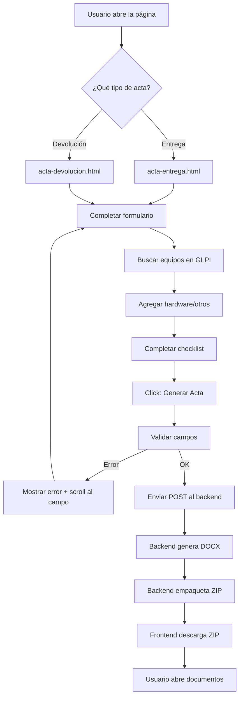
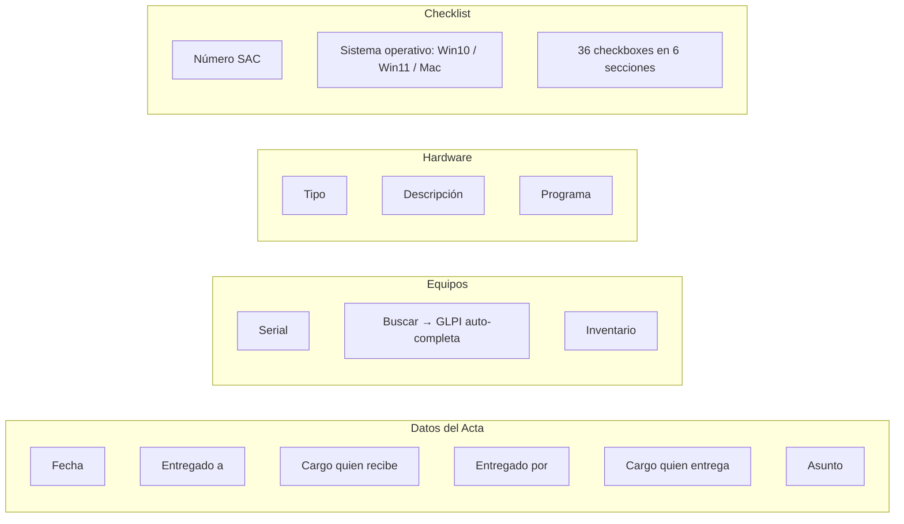
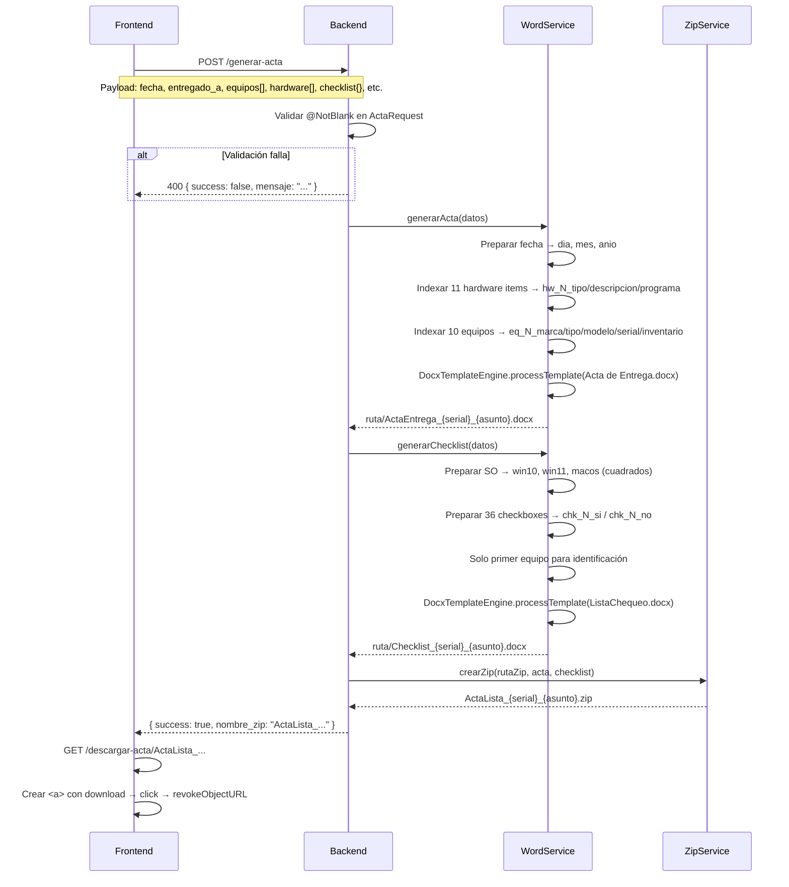
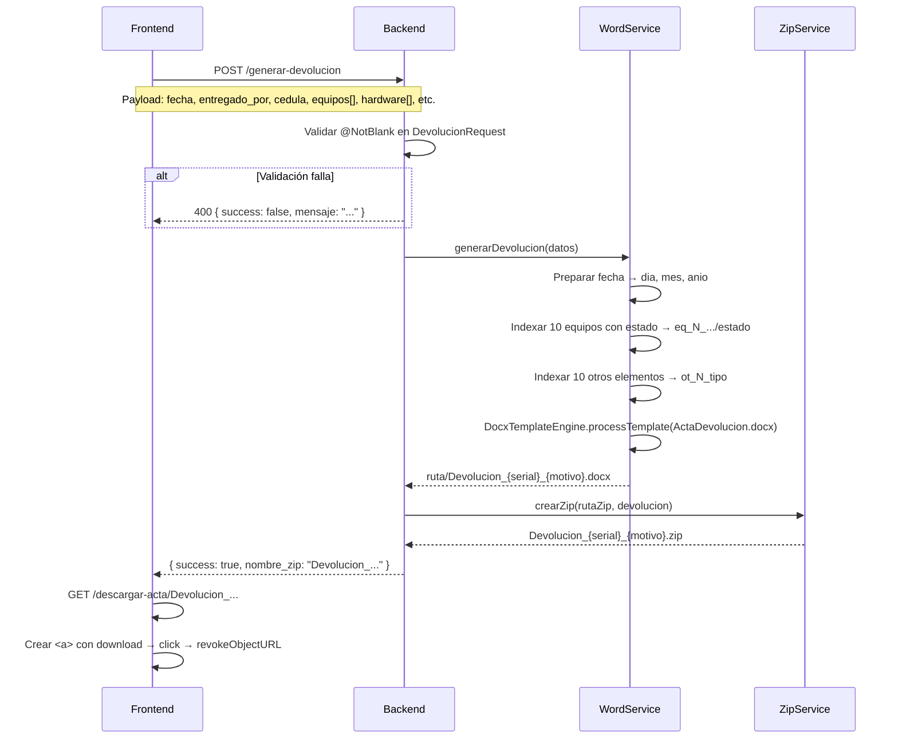

# Flujo Funcional

Este documento describe paso a paso el funcionamiento de cada tipo de acta, desde la captura de datos hasta la descarga del documento.

---

## Tabla de contenidos

1. [Flujo general del sistema](#1-flujo-general-del-sistema)
2. [Acta de Entrega](#2-acta-de-entrega)
3. [Acta de Devolución](#3-acta-de-devolución)
4. [Búsqueda de equipo en GLPI](#4-búsqueda-de-equipo-en-glpi)
5. [Generación de documentos Word](#5-generación-de-documentos-word)
6. [Empaquetado y descarga ZIP](#6-empaquetado-y-descarga-zip)
7. [Validaciones](#7-validaciones)

---

## 1. Flujo general del sistema



---

## 2. Acta de Entrega

La acta de entrega genera **dos documentos**: el acta de entrega y la lista de chequeo.

### 2.1 Captura de datos



**Campos obligatorios del acta:** Fecha, Entregado a, Cargo quien recibe, Entregado por, Cargo quien entrega, Asunto, Número SAC.

**Campos obligatorios por equipo:** Serial, Inventario.

**Campos del checklist:** Sistema operativo (radio), 36 checkboxes agrupados.

### 2.2 Checklist — Secciones

| Sección | Checkboxes | Ejemplos |
|---------|-----------|----------|
| Seguridad y Configuración | 1–10 | Antivirus, DLP, Cifrado, Firewall |
| Software Base | 11–18 | Office, Adobe Reader, Java, 7-Zip |
| Sistema Operativo | 19–24 | NetBIOS, Wake On LAN, OneDrive |
| Conectividad | 25–27 | VPN, RDP, Impresoras |
| Aplicaciones Corporativas | 28–32 | Directorio Activo, Cobis, Cisco |
| Áreas Específicas | 33–36 | Comercio Exterior, Tesorería |

### 2.3 Envío y respuesta



### 2.4 Documentos generados

| Documento | Contenido |
|-----------|-----------|
| `ActaEntrega_{serial}_{asunto}.docx` | Acta de entrega con datos de entrega, equipos y hardware |
| `Checklist_{serial}_{asunto}.docx` | Lista de 36 verificaciones con SO y datos del primer equipo |

---

## 3. Acta de Devolución

La acta de devolución genera **un solo documento**: el acta de devolución.

### 3.1 Captura de datos

```mermaid
flowchart LR
    subgraph Datos del Acta
        A1[Fecha]
        A2[Nombre quien entrega]
        A3[Cédula quien entrega]
        A4[Cargo quien entrega]
        A5[Recibido por]
        A6[Cargo quien recibe]
        A7[Área quien recibe]
        A8[Motivo devolución]
        A9[Nombre jefe inmediato]
        A10[Cargo jefe inmediato]
    end

    subgraph Equipos
        B1[Serial]
        B2[Buscar → GLPI auto-completa]
        B3[Inventario]
        B4[Estado]  ← Diferencia con entrega
    end

    subgraph Otros Elementos
        C1[Tipo]  ← Solo tipo, sin descripción
    end
```

**Campos obligatorios:** Fecha, Nombre quien entrega, Cédula, Cargo quien entrega, Recibido por, Cargo quien recibe, Área quien recibe, Motivo, Nombre jefe, Cargo jefe.

**Campos obligatorios por equipo:** Serial, Inventario, **Estado**.

> **Diferencia clave con entrega:** El acta de devolución NO incluye checklist ni sistema operativo. SÍ incluye campo "Estado" por cada equipo.

### 3.2 Envío y respuesta



### 3.3 Documento generado

| Documento | Contenido |
|-----------|-----------|
| `Devolucion_{serial}_{motivo}.docx` | Acta de devolución con datos de entrega/devolución, equipos con estado y otros elementos |

---

## 4. Búsqueda de equipo en GLPI

Cuando el usuario hace click en "Buscar" dentro de un bloque de equipo:

```mermaid
flowchart TD
    A[Click "Buscar"] --> B[Leer serial del input]
    B --> C[GET /equipo/{serial}]
    C --> D[Backend: POST /initSession]
    D --> E[Backend: GET /search/Computer]
    E --> F{¿Equipo encontrado?}
    F -->|No| G[Retornar marca/tipo/modelo vacíos]
    F -->|Sí| H[Extraer campos: 23=marca, 4=tipo, 40=modelo, 17=cpu]
    H --> I[Abreviar CPU: "Core(TM) i5-12400" → "Core i5"]
    I --> J[Concatenar modelo + sufijo CPU]
    J --> K[Retornar EquipoResponse]
    G --> L[Actualizar inputs deshabilitados]
    K --> L
    L --> M[Marca, Tipo, Modelo auto-completados]
```

**Procesamiento del CPU:**

El nombre completo del procesador se abrevia para el acta:

| GLPI (campo 17) | Acta |
|-----------------|------|
| `Intel(R) Core(TM) i5-12400` | `Core i5` |
| `AMD Ryzen 5 5600X` | `Ryzen 5` |
| `12th Gen Intel(R) Core(TM) i7-12700K` | `Core i7` |
| `Intel(R) Xeon(R) E5-2620` | `Xeon` |

---

## 5. Generación de documentos Word

### 5.1 Motor de templates (DocxTemplateEngine)

El motor reemplaza placeholders `{{ variable }}` en documentos Word preservando el formato original.

```mermaid
flowchart TD
    A[Template DOCX] --> B[Copiar a archivo de salida]
    B --> C[Abrir con Apache POI]
    C --> D{¿Más párrafos?}
    D -->|Sí| E[Leer runs del párrafo]
    E --> F[Concatenar texto de todos los runs]
    F --> G{¿Contiene {{ ?}
    G -->|No| D
    G -->|Sí| H[Buscar placeholders con regex]
    H --> I[Para cada run: reconstruir texto]
    I --> J[Reemplazar placeholder con valor]
    J --> K[Guardar texto en el run]
    K --> D
    D -->|No| L[Procesar tablas]
    L --> M[Guardar documento]
```

### 5.2 Por qué a nivel de run

Cuando Word aplica formato diferente (negrita, color, tamaño) a partes de un mismo texto, lo fragmenta en múltiples "runs". Ejemplo:

```
Run 1: "Serial: "        (formato normal)
Run 2: "{{ eq_1_serial }}" (formato negrita)
Run 3: " "               (formato normal)
```

El placeholder `{{ eq_1_serial }}` está completamente en el Run 2. Este motor detecta en qué run inicia el placeholder y escribe el valor ahí, preservando la negrita del Run 2.

### 5.3 Preparación de datos

Antes de pasar los datos al motor, `DocumentoWordService` transforma la información:

**Fecha:**
```
fecha: "2026-07-23"  →  dia: "23", mes: "07", anio: "2026"
```

**Equipos (indexados):**
```
equipos[0].marca = "Dell"     →  eq_1_marca = "Dell"
equipos[0].serial = "ABC123"  →  eq_1_serial = "ABC123"
equipos[1].marca = "HP"       →  eq_2_marca = "HP"
```

**Hardware (indexado):**
```
hardware[0].tipo = "Monitor"       →  hw_1_tipo = "Monitor"
hardware[0].descripcion = "24 pulgadas" →  hw_1_descripcion = "24 pulgadas"
```

**Checkboxes (marcados/desmarcados):**
```
chk_1 = true   →  chk_1_si = "■", chk_1_no = "□"
chk_2 = false  →  chk_2_si = "□", chk_2_no = "■"
```

**Sistema operativo:**
```
sistema_operativo = "Windows 11"
  → win10 = "□", win11 = "■", macos = "□"
```

---

## 6. Empaquetado y descarga ZIP

### 6.1 Creación del ZIP

```mermaid
flowchart LR
    A[DOCX 1: Acta] --> C[ZipOutputStream]
    B[DOCX 2: Checklist] --> C
    C --> D[ZIP: ActaLista_{serial}_{asunto}.zip]
```

El nombre del ZIP se construye con:
- **Entrega:** `ActaLista_` + serial del primer equipo + `_` + asunto (sin caracteres especiales) + `.zip`
- **Devolución:** `Devolucion_` + serial del primer equipo + `_` + motivo (sin caracteres especiales) + `.zip`

Los caracteres especiales se eliminan del asunto/motivo con `replaceAll("[^a-zA-Z0-9]", "")`.

### 6.2 Descarga

```mermaid
sequenceDiagram
    participant U as Frontend
    participant B as Backend
    participant N as Navegador

    U->>B: GET /descargar-acta/{nombreZip}
    B->>B: Verificar que el archivo existe
    alt Archivo no existe
        B-->>U: { success: false, mensaje: "Archivo no encontrado" }
    end
    B-->>U: 200 OK + Content-Type: application/octet-stream
    Note over U: Content-Disposition: attachment; filename="..."

    U->>U: Crear Blob desde response
    U->>U: Crear URL temporal (URL.createObjectURL)
    U->>U: Crear elemento <a> con href=URL, download=nombreZip
    U->>U: Agregar <a> al DOM
    U->>N: click() en el <a>
    N->>N: Descargar archivo
    U->>U: Eliminar <a> del DOM
    U->>U: Revocar URL temporal
```

El navegador muestra la descarga en la barra de descargas. El usuario puede abrir el ZIP directamente.

---

## 7. Validaciones

### 7.1 Acta de Entrega


### 7.2 Acta de Devolución

Mismo flujo que entrega, con estas diferencias:

- **Campos obligatorios diferentes:** Incluye cédula, área, motivo, nombre/cargo jefe.
- **Sin validación de SO:** No hay sistema operativo.
- **Validación de equipo incluye Estado:** Serial + Inventario + Estado son obligatorios.
- **Sin checklist:** Se omite toda la sección de verificación.

### 7.3 Resumen de validaciones por campo

| Campo | Entrega | Devolución | Obligatorio |
|-------|---------|------------|-------------|
| Fecha | Si | Si | Si |
| Entregado a | Si | No | Si |
| Cargo quien recibe | Si | Si | Si |
| Entregado por | Si | Si | Si |
| Cargo quien entrega | Si | Si | Si |
| Asunto | Si | No | Si |
| Número SAC | Si | No | Si |
| Sistema operativo | Si | No | Si |
| Cédula | No | Si | Si |
| Área quien recibe | No | Si | Si |
| Motivo | No | Si | Si |
| Nombre jefe | No | Si | Si |
| Cargo jefe | No | Si | Si |
| Serial equipo | Si | Si | Si |
| Inventario equipo | Si | Si | Si |
| Estado equipo | No | Si | Si |
