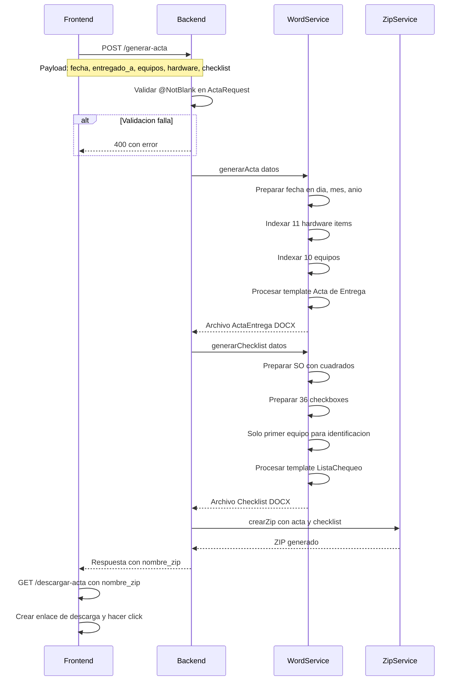
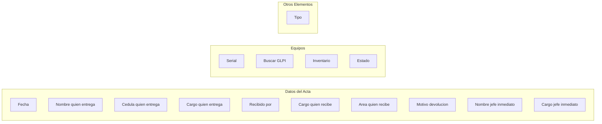
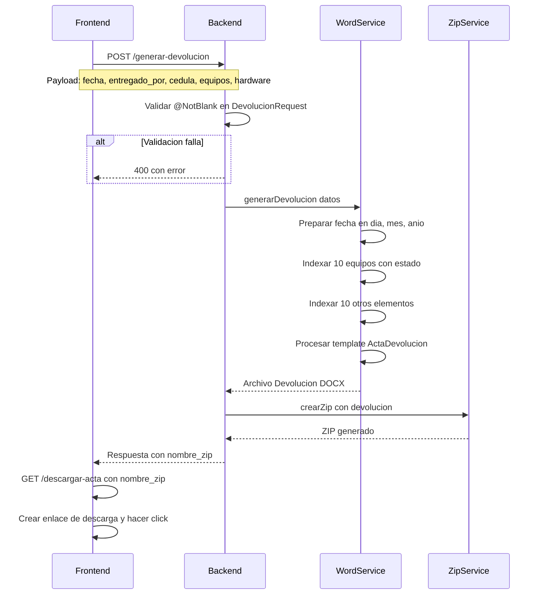
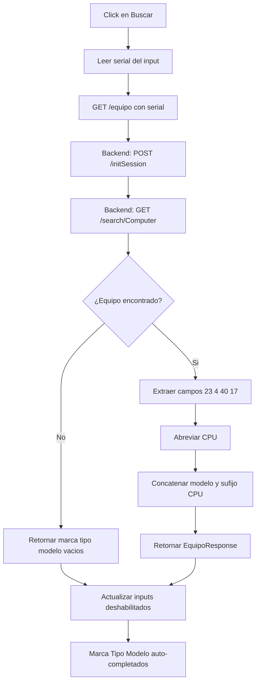
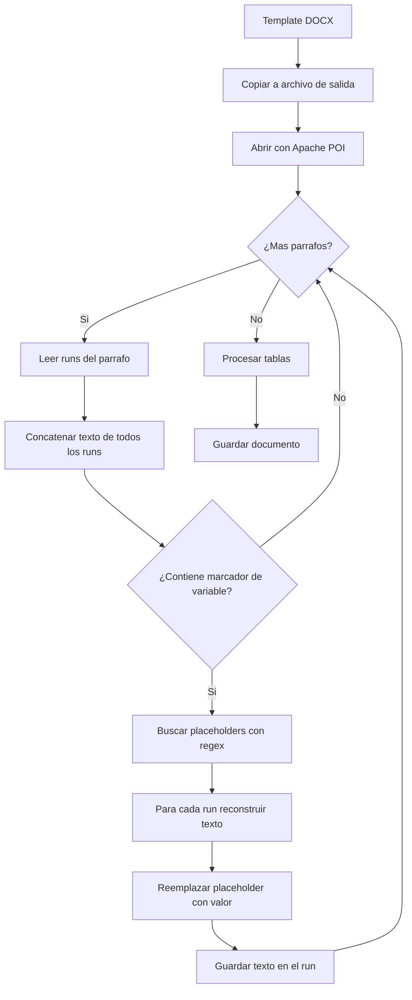
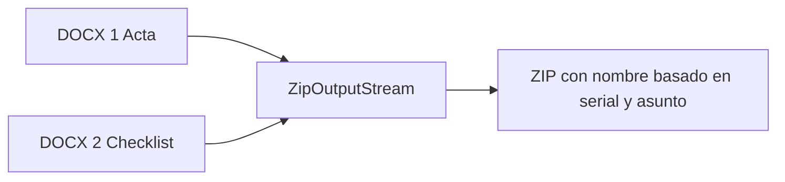
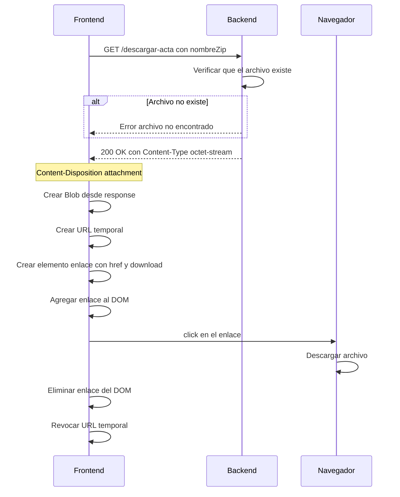
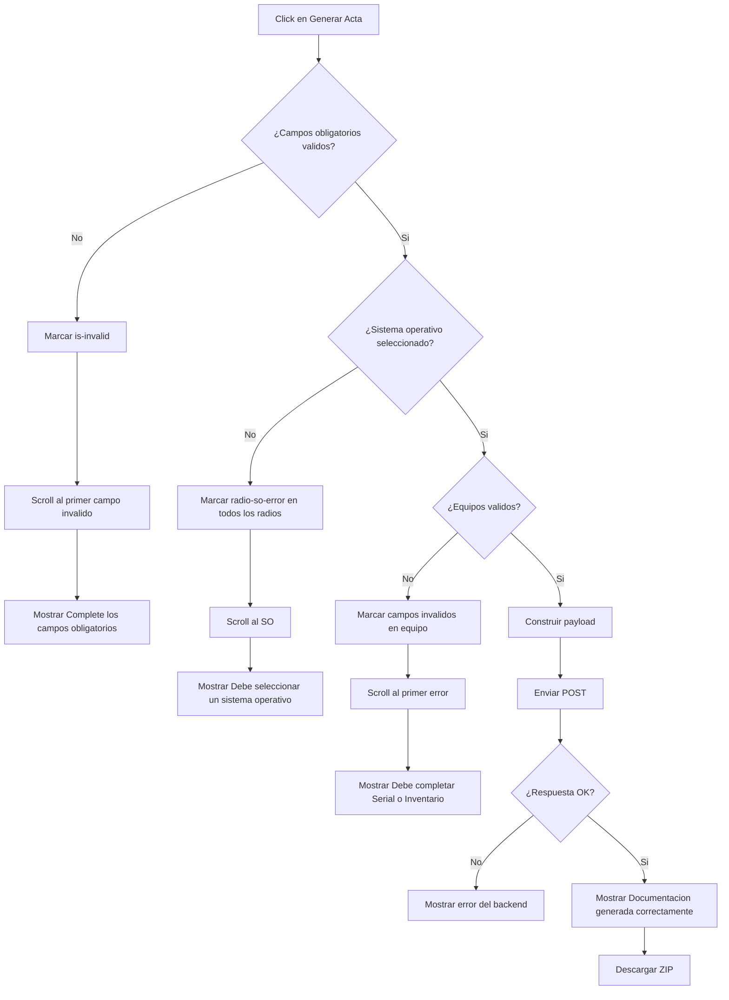

# Flujo Funcional

Este documento describe paso a paso el funcionamiento de cada tipo de acta, desde la captura de datos hasta la descarga del documento.

---

## Tabla de contenidos

1. [Flujo general del sistema](#1-flujo-general-del-sistema)
2. [Acta de Entrega](#2-acta-de-entrega)
3. [Acta de Devolución](#3-acta-de-devolución)
4. [Búsqueda de equipo en GLPI](#4-búsqueda-de-equipo-en-glpi)
5. [Generación de documentos Word](#5-generación-de-documentos-word)
6. [Empaquetado y descarga ZIP](#6-empaquetado-y-descarga-zip)
7. [Validaciones](#7-validaciones)

---

## 1. Flujo general del sistema


---

## 2. Acta de Entrega

La acta de entrega genera **dos documentos**: el acta de entrega y la lista de chequeo.

### 2.1 Captura de datos


**Campos obligatorios del acta:** Fecha, Entregado a, Cargo quien recibe, Entregado por, Cargo quien entrega, Asunto, Número SAC.

**Campos obligatorios por equipo:** Serial, Inventario.

**Campos del checklist:** Sistema operativo (radio), 36 checkboxes agrupados.

### 2.2 Checklist - Secciones

| Sección | Checkboxes | Ejemplos |
|---------|-----------|----------|
| Seguridad y Configuración | 1–10 | Antivirus, DLP, Cifrado, Firewall |
| Software Base | 11–18 | Office, Adobe Reader, Java, 7-Zip |
| Sistema Operativo | 19–24 | NetBIOS, Wake On LAN, OneDrive |
| Conectividad | 25–27 | VPN, RDP, Impresoras |
| Aplicaciones Corporativas | 28–32 | Directorio Activo, Cobis, Cisco |
| Áreas Específicas | 33–36 | Comercio Exterior, Tesorería |

### 2.3 Envío y respuesta



### 2.4 Documentos generados

| Documento | Contenido |
|-----------|-----------|
| ActaEntrega con serial y asunto | Acta de entrega con datos de entrega, equipos y hardware |
| Checklist con serial y asunto | Lista de 36 verificaciones con SO y datos del primer equipo |

---

## 3. Acta de Devolución

La acta de devolución genera **un solo documento**: el acta de devolución.

### 3.1 Captura de datos



> **Nota:** El campo **Estado** existe unicamente en el flujo de devolucion. El bloque **Otros Elementos** solo solicita el tipo de elemento y no incluye descripcion.

**Campos obligatorios:** Fecha, Nombre quien entrega, Cedula, Cargo quien entrega, Recibido por, Cargo quien recibe, Area quien recibe, Motivo, Nombre jefe, Cargo jefe.

**Campos obligatorios por equipo:** Serial, Inventario, **Estado**.

> **Diferencia clave con entrega:** El acta de devolucion NO incluye checklist ni sistema operativo. SI incluye campo "Estado" por cada equipo.

### 3.2 Envío y respuesta



### 3.3 Documento generado

| Documento | Contenido |
|-----------|-----------|
| Devolucion con serial y motivo | Acta de devolucion con datos de entrega y devolucion, equipos con estado y otros elementos |

---

## 4. Búsqueda de equipo en GLPI

Cuando el usuario hace click en "Buscar" dentro de un bloque de equipo:



**Procesamiento del CPU:**

El nombre completo del procesador se abrevia para el acta:

| GLPI campo 17 | Acta |
|-----------------|------|
| Intel Core i5-12400 | Core i5 |
| AMD Ryzen 5 5600X | Ryzen 5 |
| 12th Gen Intel Core i7-12700K | Core i7 |
| Intel Xeon E5-2620 | Xeon |

---

## 5. Generación de documentos Word

### 5.1 Motor de templates DocxTemplateEngine

El motor reemplaza placeholders en formato doble llave en documentos Word preservando el formato original.



### 5.2 Por qué a nivel de run

Cuando Word aplica formato diferente (negrita, color, tamaño) a partes de un mismo texto, lo fragmenta en multiples "runs". Ejemplo:

```
Run 1: "Serial: "           formato normal
Run 2: "placeholder_serial" formato negrita
Run 3: " "                  formato normal
```

El placeholder esta completamente en el Run 2. Este motor detecta en que run inicia el placeholder y escribe el valor ahi, preservando la negrita del Run 2.

### 5.3 Preparación de datos

Antes de pasar los datos al motor, DocumentoWordService transforma la informacion:

**Fecha:**

```
fecha: 2026-07-23  -->  dia: 23, mes: 07, anio: 2026
```

**Equipos indexados:**

```
equipos[0].marca = Dell      -->  eq_1_marca = Dell
equipos[0].serial = ABC123   -->  eq_1_serial = ABC123
equipos[1].marca = HP        -->  eq_2_marca = HP
```

**Hardware indexado:**

```
hardware[0].tipo = Monitor            -->  hw_1_tipo = Monitor
hardware[0].descripcion = 24 pulgadas -->  hw_1_descripcion = 24 pulgadas
```

**Checkboxes marcados y desmarcados:**

```
chk_1 = true   -->  chk_1_si = cuadrado lleno, chk_1_no = cuadrado vacio
chk_2 = false  -->  chk_2_si = cuadrado vacio, chk_2_no = cuadrado lleno
```

**Sistema operativo:**

```
sistema_operativo = Windows 11
  --> win10 = vacio, win11 = lleno, macos = vacio
```

---

## 6. Empaquetado y descarga ZIP

### 6.1 Creación del ZIP



El nombre del ZIP se construye con:

- **Entrega:** ActaLista + serial del primer equipo + guion bajo + asunto sin caracteres especiales + .zip
- **Devolución:** Devolucion + serial del primer equipo + guion bajo + motivo sin caracteres especiales + .zip

Los caracteres especiales se eliminan del asunto o motivo con replaceAll.

### 6.2 Descarga



El navegador muestra la descarga en la barra de descargas. El usuario puede abrir el ZIP directamente.

---

## 7. Validaciones

### 7.1 Acta de Entrega



### 7.2 Acta de Devolución

Mismo flujo que entrega, con estas diferencias:

- **Campos obligatorios diferentes:** Incluye cedula, area, motivo, nombre y cargo jefe.
- **Sin validacion de SO:** No hay sistema operativo.
- **Validacion de equipo incluye Estado:** Serial, Inventario y Estado son obligatorios.
- **Sin checklist:** Se omite toda la seccion de verificacion.

### 7.3 Resumen de validaciones por campo

| Campo | Entrega | Devolución | Obligatorio |
|-------|---------|------------|-------------|
| Fecha | Si | Si | Si |
| Entregado a | Si | No | Si |
| Cargo quien recibe | Si | Si | Si |
| Entregado por | Si | Si | Si |
| Cargo quien entrega | Si | Si | Si |
| Asunto | Si | No | Si |
| Número SAC | Si | No | Si |
| Sistema operativo | Si | No | Si |
| Cédula | No | Si | Si |
| Área quien recibe | No | Si | Si |
| Motivo | No | Si | Si |
| Nombre jefe | No | Si | Si |
| Cargo jefe | No | Si | Si |
| Serial equipo | Si | Si | Si |
| Inventario equipo | Si | Si | Si |
| Estado equipo | No | Si | Si |
