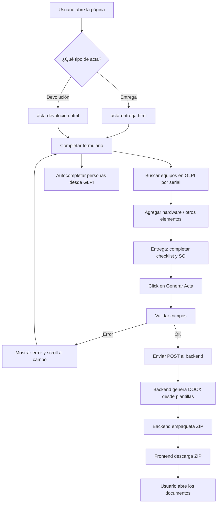
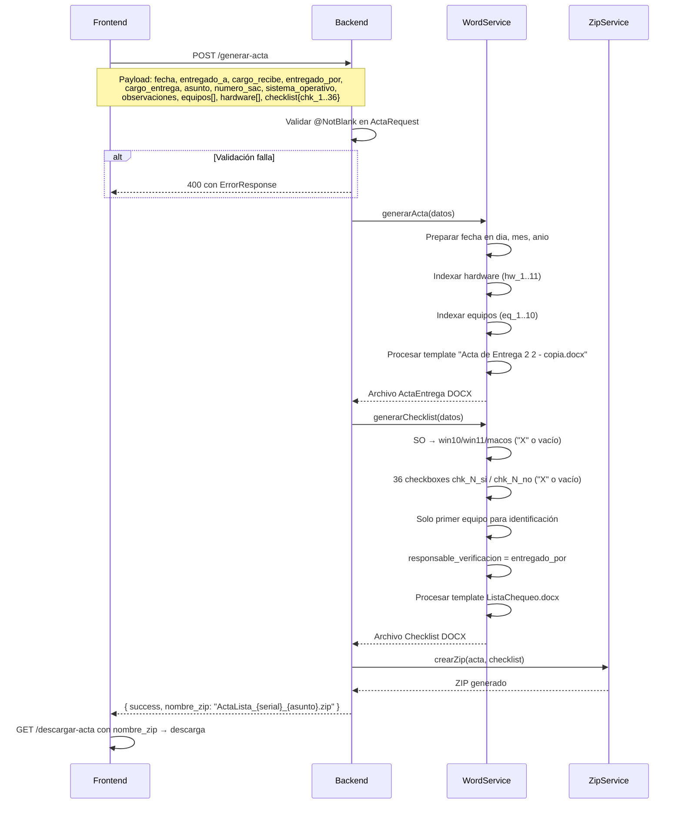
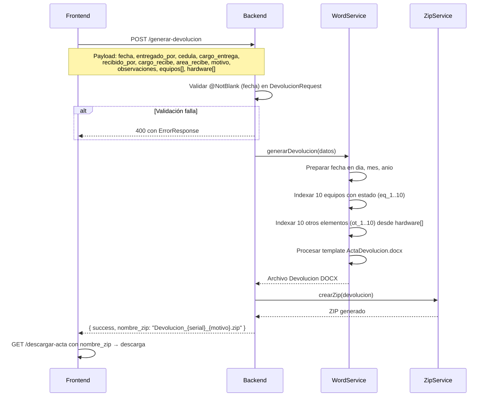
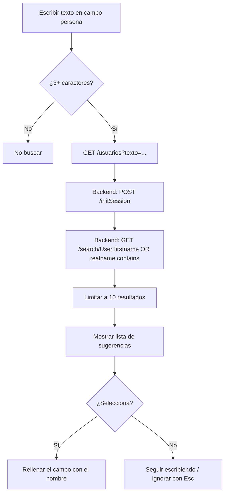
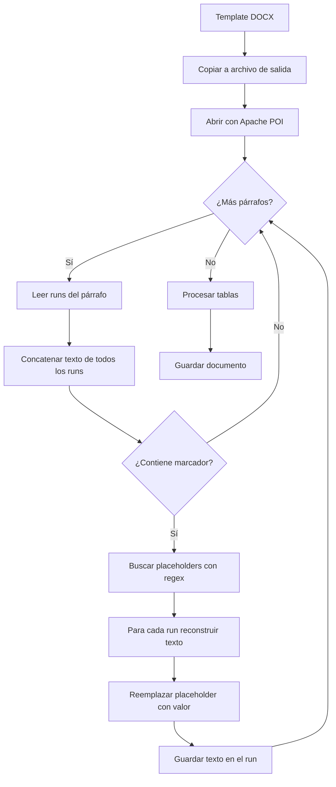
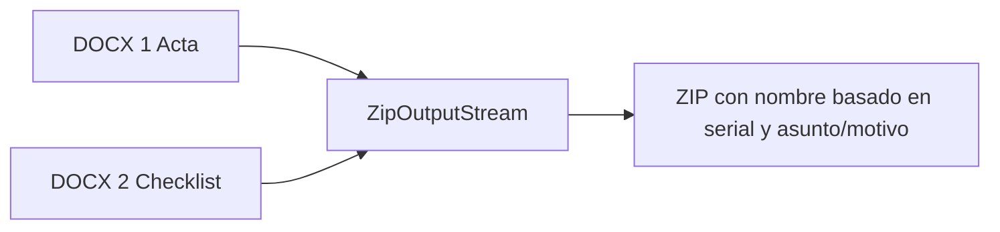
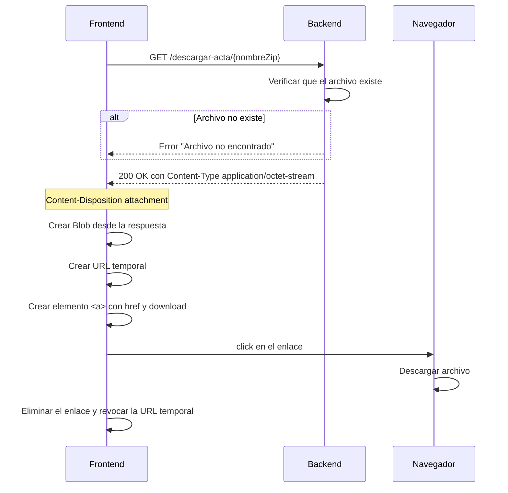

# Flujo Funcional

Este documento describe paso a paso el funcionamiento de cada tipo de acta, desde la captura de datos hasta la descarga del documento.

---

## Tabla de contenidos

1. [Flujo general del sistema](#1-flujo-general-del-sistema)
2. [Acta de Entrega](#2-acta-de-entrega)
3. [Acta de Devolución](#3-acta-de-devolución)
4. [Búsqueda de equipo en GLPI](#4-búsqueda-de-equipo-en-glpi)
5. [Autocompletado de usuarios](#5-autocompletado-de-usuarios)
6. [Generación de documentos Word](#6-generación-de-documentos-word)
7. [Empaquetado y descarga ZIP](#7-empaquetado-y-descarga-zip)
8. [Validaciones](#8-validaciones)

---

## 1. Flujo general del sistema


```mermaid
flowchart TD
    A[Usuario abre la página] --> B{¿Qué tipo de acta?}
    B -->|Entrega| C[acta-entrega.html]
    B -->|Devolución| D[acta-devolucion.html]
    C --> E[Completar formulario]
    D --> E
    E --> F[Buscar equipos en GLPI por serial]
    E --> F2[Autocompletar personas desde GLPI]
    F --> G[Agregar hardware / otros elementos]
    G --> H[Entrega: completar checklist y SO]
    H --> I[Click en Generar Acta]
    I --> J[Validar campos]
    J -->|Error| K[Mostrar error y scroll al campo]
    K --> E
    J -->|OK| L[Enviar POST al backend]
    L --> M[Backend genera DOCX desde plantillas]
    M --> N[Backend empaqueta ZIP]
    N --> O[Frontend descarga ZIP]
    O --> P[Usuario abre los documentos]
```

---

## 2. Acta de Entrega

La acta de entrega genera **dos documentos**: el acta de entrega y la lista de chequeo.

### 2.1 Captura de datos

```mermaid
flowchart LR
    subgraph DatosActa["Datos del Acta"]
        A1[Fecha]
        A2[Entregado a (autocompletable)]
        A3[Cargo quien recibe]
        A4[Entregado por (autocompletable)]
        A5[Cargo quien entrega]
        A6[Asunto]
        A7[Número SAC]
        A8[Sistema operativo]
    end

    subgraph Equi["Equipos (máx. 3)"]
        B1[Serial]
        B2[Buscar - GLPI auto-completa marca/tipo/modelo]
        B3[Inventario]
    end

    subgraph Hard["Hardware / Software (máx. 9)"]
        C1[Tipo]
        C2[Descripción]
        C3[Programa]
    end

    subgraph Check["Checklist"]
        D1[36 checkboxes en 6 secciones]
    end
```

**Campos obligatorios del acta:** Fecha, Entregado a, Cargo quien recibe, Entregado por, Cargo quien entrega, Asunto, Número SAC, Sistema operativo.

**Campos obligatorios por equipo:** Serial, Inventario.

### 2.2 Checklist — Secciones

| Sección | Checkboxes | Ejemplos |
|---------|-----------|----------|
| Seguridad y Configuración | 1–10 | Antivirus, DLP, Cifrado, Firewall |
| Software Base | 11–18 | Office, Adobe Reader, Java, 7-Zip |
| Sistema Operativo | 19–24 | NetBIOS, Wake On LAN, OneDrive |
| Conectividad | 25–27 | VPN, RDP, Impresoras |
| Aplicaciones Corporativas | 28–32 | Directorio Activo, Cobis, Cisco |
| Áreas Específicas | 33–36 | Comercio Exterior, Tesorería |

### 2.3 Envío y respuesta


```mermaid
sequenceDiagram
    participant U as Frontend
    participant B as Backend
    participant W as WordService
    participant Z as ZipService

    U->>B: POST /generar-acta
    Note over U,B: Payload: fecha, entregado_a, cargo_recibe, entregado_por,<br/>cargo_entrega, asunto, numero_sac, sistema_operativo,<br/>observaciones, equipos[], hardware[], checklist{chk_1..36}

    B->>B: Validar @NotBlank en ActaRequest
    alt Validación falla
        B-->>U: 400 con ErrorResponse
    end

    B->>W: generarActa(datos)
    W->>W: Preparar fecha en dia, mes, anio
    W->>W: Indexar hardware (hw_1..11)
    W->>W: Indexar equipos (eq_1..10)
    W->>W: Procesar template "Acta de Entrega 2 2 - copia.docx"
    W-->>B: Archivo ActaEntrega DOCX

    B->>W: generarChecklist(datos)
    W->>W: SO → win10/win11/macos ("X" o vacío)
    W->>W: 36 checkboxes chk_N_si / chk_N_no ("X" o vacío)
    W->>W: Solo primer equipo para identificación
    W->>W: responsable_verificacion = entregado_por
    W->>W: Procesar template ListaChequeo.docx
    W-->>B: Archivo Checklist DOCX

    B->>Z: crearZip(acta, checklist)
    Z-->>B: ZIP generado

    B-->>U: { success, nombre_zip: "ActaLista_{serial}_{asunto}.zip" }
    U->>U: GET /descargar-acta con nombre_zip → descarga
```

### 2.4 Documentos generados

| Documento | Contenido |
|-----------|-----------|
| ActaEntrega con serial y asunto | Datos de entrega, equipos y hardware |
| Checklist con serial y asunto | 36 verificaciones, SO y datos del primer equipo |

---

## 3. Acta de Devolución

La acta de devolución genera **un solo documento**: el acta de devolución.

### 3.1 Captura de datos

```mermaid
flowchart LR
    subgraph DatosActa["Datos del Acta"]
        A1[Fecha]
        A2[Entregado por (autocompletable)]
        A3[Cédula quien entrega]
        A4[Cargo quien entrega]
        A5[Recibido por (autocompletable)]
        A6[Cargo quien recibe]
        A7[Área quien recibe]
        A8[Motivo devolución]
    end

    subgraph Equi["Equipos (máx. 3)"]
        B1[Serial]
        B2[Buscar GLPI]
        B3[Inventario]
        B4[Estado]
    end

    subgraph Otros["Otros Elementos (máx. 3)"]
        C1[Tipo]
    end
```

> **Nota:** El campo **Estado** existe únicamente en el flujo de devolución. El bloque **Otros Elementos** solo solicita el tipo de elemento (no incluye descripción ni programa).

**Campos obligatorios:** Fecha, Nombre quien entrega, Cédula, Cargo quien entrega, Recibido por, Cargo quien recibe, Área quien recibe, Motivo.

**Campos obligatorios por equipo:** Serial, Inventario, **Estado**.

> **Diferencia clave con entrega:** La devolución NO incluye checklist ni sistema operativo. SÍ incluye el campo "Estado" por equipo y el bloque "Otros Elementos".

### 3.2 Envío y respuesta


```mermaid
sequenceDiagram
    participant U as Frontend
    participant B as Backend
    participant W as WordService
    participant Z as ZipService

    U->>B: POST /generar-devolucion
    Note over U,B: Payload: fecha, entregado_por, cedula, cargo_entrega,<br/>recibido_por, cargo_recibe, area_recibe, motivo,<br/>observaciones, equipos[], hardware[]

    B->>B: Validar @NotBlank (fecha) en DevolucionRequest
    alt Validación falla
        B-->>U: 400 con ErrorResponse
    end

    B->>W: generarDevolucion(datos)
    W->>W: Preparar fecha en dia, mes, anio
    W->>W: Indexar 10 equipos con estado (eq_1..10)
    W->>W: Indexar 10 otros elementos (ot_1..10) desde hardware[]
    W->>W: Procesar template ActaDevolucion.docx
    W-->>B: Archivo Devolucion DOCX

    B->>Z: crearZip(devolucion)
    Z-->>B: ZIP generado

    B-->>U: { success, nombre_zip: "Devolucion_{serial}_{motivo}.zip" }
    U->>U: GET /descargar-acta con nombre_zip → descarga
```

### 3.3 Documento generado

| Documento | Contenido |
|-----------|-----------|
| Devolución con serial y motivo | Datos de entrega/devolución, equipos con estado y otros elementos |

---

## 4. Búsqueda de equipo en GLPI

Cuando el usuario hace click en "Buscar" dentro de un bloque de equipo:

```mermaid
flowchart TD
    A[Click en Buscar] --> B[Leer serial del input]
    B --> C[GET /equipo/{serial}]
    C --> D[Backend: POST /initSession]
    D --> E[Backend: GET /search/Computer]
    E --> F{¿Equipo encontrado?}
    F -->|No| G[Retornar marca tipo modelo vacíos]
    F -->|Sí| H[Extraer campos 23 4 40 17]
    H --> I[Abreviar CPU]
    I --> J[Concatenar modelo + sufijo CPU]
    J --> K[Retornar EquipoResponse]
    G --> L[Actualizar inputs deshabilitados]
    K --> L
    L --> M[Marca Tipo Modelo auto-completados]
```

**Procesamiento del CPU:**

El nombre completo del procesador se abrevia para el acta (regex en `EquipoService.cpuCorto`):

| GLPI campo 17 | Acta |
|-----------------|------|
| Intel(R) Core(TM) i5-12400 | Core i5 |
| AMD Ryzen 5 5600X | Ryzen 5 |
| 12th Gen Intel(R) Core(TM) i7-12700K | Core i7 |
| Intel(R) Xeon E5-2620 | Xeon |

> **Nota:** Si GLPI no responde o no encuentra el equipo, la respuesta es un `EquipoResponse` con `marca`, `tipo` y `modelo` vacíos. El backend nunca rompe el flujo por un error de GLPI (manejo silencioso).

---

## 5. Autocompletado de usuarios

Se activa al escribir **3 o más caracteres** en los campos de personas:


```mermaid
flowchart TD
    A[Escribir texto en campo persona] --> B{¿3+ caracteres?}
    B -->|No| C[No buscar]
    B -->|Sí| D[GET /usuarios?texto=...]
    D --> E[Backend: POST /initSession]
    E --> F[Backend: GET /search/User firstname OR realname contains]
    F --> G[Limitar a 10 resultados]
    G --> H[Mostrar lista de sugerencias]
    H --> I{¿Selecciona?}
    I -->|Sí| J[Rellenar el campo con el nombre]
    I -->|No| K[Seguir escribiendo / ignorar con Esc]
```

| Página | Campos |
|--------|--------|
| Acta de Entrega | Entregado a, Entregado por |
| Acta de Devolución | Entregado por, Recibido por |

---

## 6. Generación de documentos Word

### 6.1 Motor de templates DocxTemplateEngine

El motor reemplaza placeholders en formato doble llave (`{{ var }}`) en documentos Word preservando el formato original.


```mermaid
flowchart TD
    A[Template DOCX] --> B[Copiar a archivo de salida]
    B --> C[Abrir con Apache POI]
    C --> D{¿Más párrafos?}
    D -->|Sí| E[Leer runs del párrafo]
    E --> F[Concatenar texto de todos los runs]
    F --> G{¿Contiene marcador?}
    G -->|No| D
    G -->|Sí| H[Buscar placeholders con regex]
    H --> I[Para cada run reconstruir texto]
    I --> J[Reemplazar placeholder con valor]
    J --> K[Guardar texto en el run]
    K --> D
    D -->|No| L[Procesar tablas]
    L --> M[Guardar documento]
```

### 6.2 Por qué a nivel de run

Cuando Word aplica formato diferente (negrita, color, tamaño) a partes de un mismo texto, lo fragmenta en múltiples "runs". Ejemplo:

```
Run 1: "Serial: "           formato normal
Run 2: "placeholder_serial" formato negrita
Run 3: " "                  formato normal
```

Este motor detecta en qué run inicia el placeholder y escribe el valor ahí, preservando la negrita del Run 2.

### 6.3 Preparación de datos

Antes de pasar los datos al motor, `DocumentoWordService` transforma la información:

**Fecha:**

```
fecha: 2026-07-23  →  dia: 23, mes: 07, anio: 2026
```

**Equipos indexados:**

```
equipos[0].marca = Dell      →  eq_1_marca = Dell
equipos[0].serial = ABC123   →  eq_1_serial = ABC123
equipos[1].marca = HP        →  eq_2_marca = HP
```

**Hardware indexado (acta de entrega):**

```
hardware[0].tipo = Monitor            →  hw_1_tipo = Monitor
hardware[0].descripcion = 24 pulgadas →  hw_1_descripcion = 24 pulgadas
```

**Otros elementos (acta de devolución):**

```
hardware[0].tipo = Teclado  →  ot_1_tipo = Teclado
```

**Checkboxes marcados y desmarcados (carácter "X"):**

```
chk_1 = true   →  chk_1_si = "X", chk_1_no = ""
chk_2 = false  →  chk_2_si = "",  chk_2_no = "X"
```

**Sistema operativo:**

```
sistema_operativo = Windows 11
  →  win10 = "", win11 = "X", macos = ""
```

**Límites del template (backend, se rellenan con vacío los no enviados):**

| Prefijo | Máx. |
|---------|------|
| `eq_N_` | 10 |
| `hw_N_` | 11 |
| `ot_N_` | 10 |
| `chk_N_si/no` | 36 |

---

## 7. Empaquetado y descarga ZIP

### 7.1 Creación del ZIP


```mermaid
flowchart LR
    A[DOCX 1 Acta] --> C[ZipOutputStream]
    B[DOCX 2 Checklist] --> C
    C --> D[ZIP con nombre basado en serial y asunto/motivo]
```

El nombre del ZIP se construye así:

- **Entrega:** `ActaLista` + serial del primer equipo + `_` + asunto sin caracteres especiales + `.zip`
- **Devolución:** `Devolucion` + serial del primer equipo + `_` + motivo sin caracteres especiales + `.zip`

Los caracteres especiales se eliminan con `replaceAll("[^a-zA-Z0-9]", "")`. Si no hay equipos, el serial es `SinSerial`.

### 7.2 Descarga


```mermaid
sequenceDiagram
    participant U as Frontend
    participant B as Backend
    participant N as Navegador

    U->>B: GET /descargar-acta/{nombreZip}
    B->>B: Verificar que el archivo existe
    alt Archivo no existe
        B-->>U: Error "Archivo no encontrado"
    end
    B-->>U: 200 OK con Content-Type application/octet-stream
    Note over U: Content-Disposition attachment
    U->>U: Crear Blob desde la respuesta
    U->>U: Crear URL temporal
    U->>U: Crear elemento <a> con href y download
    U->>N: click en el enlace
    N->>N: Descargar archivo
    U->>U: Eliminar el enlace y revocar la URL temporal
```

---

## 8. Validaciones

### 8.1 Acta de Entrega

```mermaid
flowchart TD
    A[Click en Generar Acta] --> B{¿Campos obligatorios válidos?}
    B -->|No| C[Marcar is-invalid]
    C --> D[Scroll al primer campo inválido]
    D --> E[Mostrar "Complete los campos obligatorios"]
    B -->|Sí| F{¿Sistema operativo seleccionado?}
    F -->|No| G[Marcar radio-so-error en los radios]
    G --> H[Scroll al SO]
    H --> I[Mostrar "Debe seleccionar un sistema operativo"]
    F -->|Sí| J{¿Equipos válidos?}
    J -->|No| K[Marcar campos inválidos en equipo]
    K --> L[Scroll al primer error]
    L --> M[Mostrar "Debe completar Serial o Inventario"]
    J -->|Sí| N[Construir payload]
    N --> O[Enviar POST]
    O --> P{¿Respuesta OK?}
    P -->|No| Q[Mostrar error del backend]
    P -->|Sí| R[Mostrar "Documentación generada correctamente"]
    R --> S[Descargar ZIP]
```

### 8.2 Acta de Devolución

Mismo flujo que entrega, con estas diferencias:

- **Campos obligatorios diferentes:** incluye cédula, área y motivo.
- **Sin validación de SO:** no hay sistema operativo.
- **Validación de equipo incluye Estado:** serial, inventario y estado son obligatorios.
- **Sin checklist:** se omite toda la sección de verificación.

### 8.3 Resumen de validaciones por campo

| Campo | Entrega | Devolución | Obligatorio |
|-------|---------|------------|-------------|
| Fecha | Si | Si | Si |
| Entregado a | Si | No | Si |
| Cargo quien recibe | Si | Si | Si |
| Entregado por | Si | Si | Si |
| Cargo quien entrega | Si | Si | Si |
| Asunto | Si | No | Si |
| Número SAC | Si | No | Si |
| Sistema operativo | Si | No | Si |
| Cédula | No | Si | Si |
| Área quien recibe | No | Si | Si |
| Motivo | No | Si | Si |
| Serial equipo | Si | Si | Si |
| Inventario equipo | Si | Si | Si |
| Estado equipo | No | Si | Si |
| Máx. equipos | 3 | 3 | — |
| Máx. hardware/otros | 9 | 3 | — |
